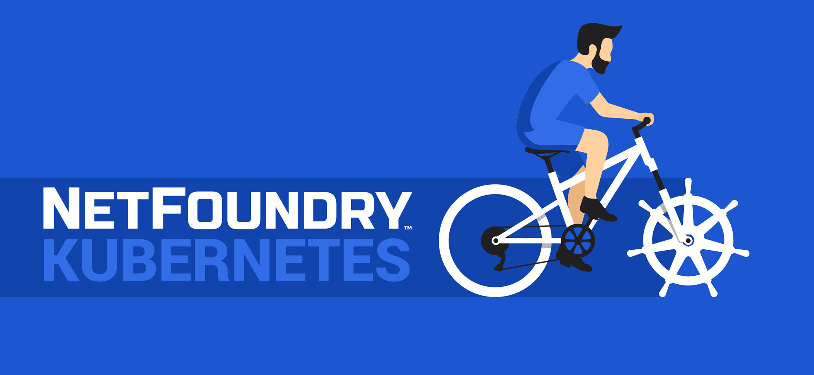
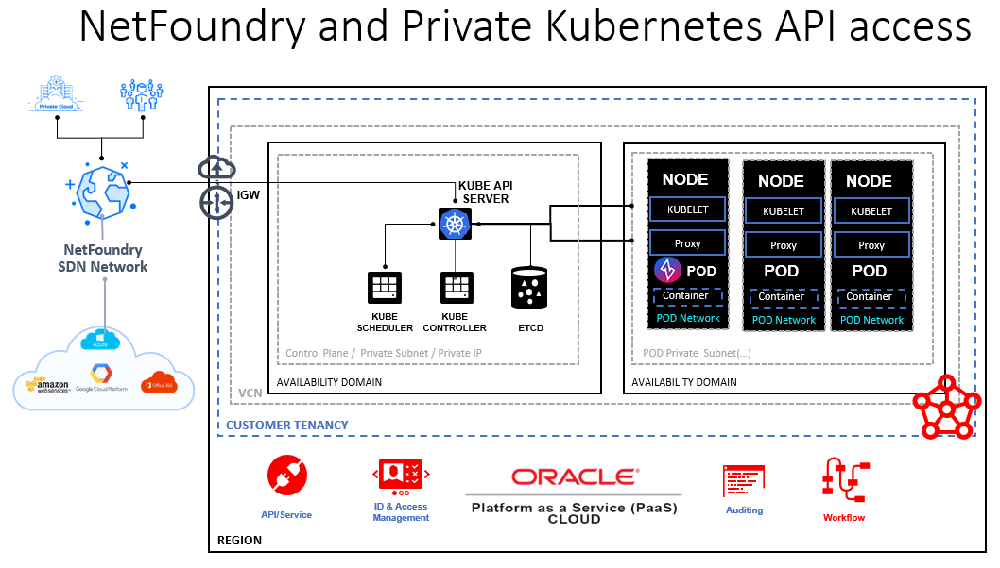

# Connecting to OKE Private API with NetFoundry Networking.

Oracle Cloud Infrastructure (OCI) & Oracle Container Engine for Kubernetes (OKE) reduces the operational burden of setting up and managing enterprise-grade Kubernetes clusters. NetFoundry and Oracle recognize that connecting to your Kubernetes cluster and its ecosystem is complex, so NetFoundry allows you to connect while also following Oracle best practice design principles:

* Secure by default: OKE hardens Kubernetes clusters following Enterprise Security best practices.

* Simplified Kubernetes operations: Oracle manages your cluster resources and automates recurrent Kubernetes administration and scaling tasks.

* High performance: Containerized applications run on high-performance Compute resources through OCI's non-blocking network.

Just a few years ago, the first major vulnerability (CVE-2018–1002105) was discovered in Kubernetes, A vulnerability on a default install, allows an attacker to access to the Kubernetes API to gain full administrator access to the cluster and everything running on it. While this vulnerability has been fixed, this leaves the question, when could it happen again or what is next? Additionally, it is possible to mistakenly leave Kubernetes implementation API server exposed to the internet or through a misconfiguration leave your environment exposed to compromise – e.g.,  [researchers are warning of increased complicated attacks targeting Kubernetes including use of malware.](https://threatpost.com/new-malware-hijacks-kubernetes-clusters-to-mine-monero/163629/)

[Earlier in the year Oracle announced](https://blogs.oracle.com/cloud-infrastructure/announcing-private-kubernetes-clusters) general availability of fully private Kubernetes clusters for Oracle Container Enginer for Kubernetes (OKE). This allows you to create fully private OKE clusters without having to expose public IP's. The standard method to connect is with FastConnect, VPN/Bastion connectivity or by restricting access to the SaaS service network IPs. Each on of these has certain weaknesses though:

* Fast Connect & dedicated, private connection – While Oracle FastConnect is cost effective and rapid to setup, interconnects and last mile can be expensive, can take months to setup and requires access through the MPLS (e.g., if remote, you would need to connect to a corporate DC VPN, which then connects into the MPLS). 

* VPN/Bastion connectivity – VPNs are quicker to setup but still have a public attack surface as well as introduce points of failure, give access to whole network, often degrade network performance, and come with high management costs and issues cause (e.g., average VPN issues takes 3.4 days). For these reasons, Gartner states “Zero Trust Network Access (ZTNA) will replace 60% of VPNs by 2023”.

* Restricting access to the SaaS service – While limiting vectors of attack, it limits the potential reach, can be cumbersome to maintain and does not protect against some sophisticated attacks around maliciously-crafted HTTP request through shared CND infrastructure. 

Ok, so what is new and how do we solve the problems above?

Oracle and technology partner NetFoundry have designed an alternative to circuit and VPN solutions using Software-Defined Network cloud technology. NetFoundry provides Zero Trust Network connectivity for any use case including Edge, Multicloud, IOT and on-premises infrastructure, remote access and application embedded. Here is more information on the NetFoundry Zero Trust Networking platform. The solution is 100% software based as well as API/Infra-As-Code compatible and thus can be instantiated directly from the Oracle Cloud console and OCI CLI using HELM Charts to deploy NetFoundry software – with very little training or specialized network skills.

NetFoundry allows Administrators to configure a NetFoundry network to publish your Oracle Kubernetes cluster’s internal services. This is a programmable approach to secure access that makes traditional alternatives like IP allow lists, virtual private networks, and bastion hosts obsolete. This also means your OKE cluster could be in any VCN, it can reach out to the internet, and the master API server need not be exposed to the public internet (i.e., no inbound ports or whitelisting IPs). Connectivity is made outbound using identity-based networking, IP addresses become redundant – in fact, multi-cloud becomes simple as we no longer must worry about the traditional network concepts of East-West and North-South, we can build app-to-app or pod-to-pod connectivity. 

You will deploy a NetFoundry endpoint as a pod on your Kubernetes cluster with a Helm chart. The endpoint may then be assigned in your NetFoundry network to host any services that are reachable inside your Kubernetes cluster. For example, the master API server used by kubectl, a Kubernetes dashboard, or any pod, service, or node IP or domain name you wish to expose to authorized remote apps, devices, or subnets.

Solution Diagram 

The diagram depicts a NetFoundry POD endpoint deployed with a Helm chart into the cluster. Remote connectivity to the Kubernetes API Server is forwarded through the NetFoundry overlay network to the POD endpoint. Private connectivity for administrative tasks or workloads can be established from any registered endpoint in any Public Cloud, On Premise location or remote user. NetFoundry is built on open source Ziti which means you can also embed connectivity directly into the application through SDKs or use endpoints such as Zero Trust Webhooks for GitHub or Gitlab for secure and private connectivity to certain SaaS services. Further, NetFoundry was developed to be operated in developer friendly environments using automation and Infrastructure-as-Code tools – more can be found here on the modules they have today.

Basic Steps and More Information

1. [Get started with Oracle Cloud here.](https://www.oracle.com/cloud/free/)
    - [VCN Information](https://docs.oracle.com/en-us/iaas/Content/GSG/Tasks/creatingnetwork.htm)
    
2. [Create a Kubernetes cluster in your OCI account with at least one worker. node.](https://docs.oracle.com/en-us/iaas/Content/ContEng/Tasks/contengcreatingclusterusingoke.htm)
NOTE: This may require upgrading your account to billing enabled.
3. [Install kubectl on the remote host for you will be using for administrative purposes.](https://kubernetes.io/docs/tasks/tools/)
4. [Install Helm, the package manager for Kubernetes.](https://helm.sh/docs/intro/quickstart/)
5. [Sign up for a free trial with NetFoundry](https://nfconsole.io/signup)

See the full demo quick start guide [here.](https://developer.netfoundry.io/guides/kubernetes/)

Once the POD is deployed, in addition to connecting to your containers in the cluster, you will be able to manage your OKE cluster over a secure Zero Trust Network.

In summary, we now have a fourth option from Oracle and NetFoundry which enables anyone to take advantage of fully private Kubernetes clusters without the same drawbacks as other solutions:

* We can create automated and private connectivity in minutes from the to any other public/private (or devices and more) with very little training or specialized skills.
* We create Zero Trust private overlays which can be highly granular, making OKE and its workloads invisible while having the reach and economics of public Internet.
* •	We achieve cloud-based consumption and economic model with automation to increase uptime and availability as well as reduce operational management costs.

