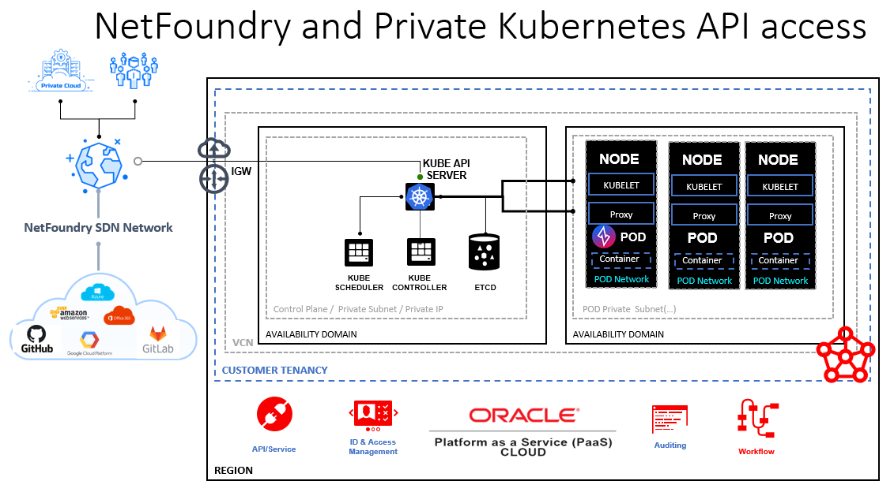

# Connecting to OKE Private API with NetFoundry Networking.

Oracle Cloud Infrastructure (OCI) & Oracle Container Engine for Kubernetes (OKE) reduce the operational burden of setting up and managing enterprise-grade Kubernetes clusters. NetFoundry and Oracle recognize that connecting to your Kubernetes cluster and its ecosystem is complex, so NetFoundry allows you to connect while also following Oracle best practice design principles:

* Secure by default: OKE hardens Kubernetes clusters following Enterprise Security best practices.

* Simplified Kubernetes operations: OKE manages your cluster resources and automates recurrent Kubernetes administration and scaling tasks.

* High performance: Containerized applications run on high-performance compute resources through OCI's non-blocking network.

## The Problem With an Exposed API

Just a few years ago, the first major vulnerability (CVE-2018–1002105) was discovered in Kubernetes. This vulnerability was present in a default installation of the Kubernetes API server and allowed an attacker to access the backend cluster services. To make matters worse, the attacker's proxied session was authenticated and masquerading as the kube-apiserver's identity. While this particular vulnerability has been fixed, the fact remains there is an obvious benefit to not exposing the Kubernetes API to attack in the first place.

## A Private Kubernetes API with OKE

Oracle recently announced general availability of fully private Kubernetes clusters for [Oracle Container Engine for Kubernetes (OKE)](https://blogs.oracle.com/cloud-infrastructure/announcing-private-kubernetes-clusters). There are a number of ways the Kubernetes administrator may connect to the private cluster API, e.g. FastConnect, VPN, SSH bastion, and now - NetFoundry networks.

### How should I connect to my private cluster?

* **Oracle FastConnect** 

    This is a dedicated, private connection from point to point. FastConnect is cost effective and rapid to set up, but prerequisites like interconnects and last mile can be expensive, require months to provision, and are not a self-contained solution; remote clients would need to first connect to a corporate VPN.

* **VPN or SSH Bastion**

    VPNs are quicker to setup but still have a public attack surface as well as introduce points of failure, give access to whole networks, often degrade network performance, and come with high management costs related to issues caused (e.g., average VPN issues takes 3.4 days). For these reasons, Gartner states “[Zero Trust Network Access (ZTNA) will replace 60% of VPNs by 2023”](https://www.gartner.com/teamsiteanalytics/servePDF?g=/imagesrv/media-products/pdf/Qi-An-Xin/Qi-An-Xin-1-1OKONUN2.pdf).

* **Static Access Controls**

    A *source IP allow list* is an example of this approach. While limiting the attack vector to known source IPs, these restrictions can be cumbersome to maintain and are not portable in a world where source IPs are rarely fixed.

* **NetFoundry Network**

    *What is NetFoundry?* Oracle and NetFoundry (an Oracle technology partner) have designed an alternative to circuit and VPN connectivity solutions using NetFoundry's cloud-native network-as-a-service (NaaS) platform. NetFoundry networks provide zero trust connectivity for any use case including edge, multicloud, IoT, and on-premises infrastructure. NetFoundry networks are pure software, hosted and orchestrated via NetFoundry's API-first platform. You may learn more about the NetFoundry zero trust platform by reading [this post](https://blogs.oracle.com/cloud-infrastructure/zero-trust-network-access-with-netfoundry).
    
    *How does NetFoundry solve these problems?* NetFoundry software is installed with a `helm install` command, the package manager for Kubernetes. Then, the Kubernetes adminstrator is able to access the private API from anywhere.

## The NetFoundry Way

You will deploy a NetFoundry network endpoint as a pod on your Kubernetes cluster with a Helm chart. The endpoint may then be assigned in your NetFoundry network to host any cluster services that are reachable inside your Kubernetes cluster. For example, the Kubernetes API used by `kubectl` or any pod or service by cluster-internal IP or cluster DNS you wish to expose to NetFoundry client endpoints.

### Developer-Friendly Ziti SDK

NetFoundry endpoints are built with open source [Ziti](https://ziti.dev/)! This  means you could create your own endpoint instead of using our tunneler apps for your client or server or both. With the Ziti SDK you may embed all of the networking capabilities of a Ziti endpoint directly in your application.

Ziti Samples
<!-- TODO: need more samples here -->
* Zero Trust Webhooks for [GitHub](https://github.com/openziti/ziti-webhook-action)
* Zero Trust Webhooks for [Gitlab](https://github.com/openziti/ziti-gitlab-webhook)

### Developer-Friendly NetFoundry API

The NetFoundry platform is API-first. This means you can automate anything you can do in the web console with HTTP requests. Today the NetFoundry SDK has a general-purpose Python module and Ansible Collection. Check out the guides to learn more!

[Developer Portal](https://developer.netfoundry.io/)

### Solution Diagram

The diagram depicts a Ziti endpoint running as a pod in a private OKE cluster.

### Solution Rationale

Remote connectivity to the Kubernetes API Server or other cluster workloads is forwarded through the NetFoundry overlay to the endpoint pod which is able to reach the API from inside the cluster.

## Step-by-Step: Install Ziti with Helm

Basic Steps and More Information

1. [Get started with Oracle Cloud here.](https://www.oracle.com/cloud/free/)
    - [VCN Information](https://docs.oracle.com/en-us/iaas/Content/GSG/Tasks/creatingnetwork.htm)
    
2. [Create a Kubernetes cluster in your OCI account with at least one worker node.](https://docs.oracle.com/en-us/iaas/Content/ContEng/Tasks/contengcreatingclusterusingoke.htm)
NOTE: This may require upgrading your account to have billing enabled.
3. [Install kubectl on the remote host you will be using for administrative purposes.](https://kubernetes.io/docs/tasks/tools/)
4. [Install Helm, the package manager for Kubernetes.](https://helm.sh/docs/intro/quickstart/)
5. [Sign up for a free trial with NetFoundry](https://nfconsole.io/signup)

See the full demo quick start guide [here.](https://developer.netfoundry.io/guides/kubernetes/)

Once the pod is deployed, in addition to connecting to your containers in the cluster, you will be able to manage your OKE cluster over a secure Zero Trust Network.

In summary, we now have a fourth option from Oracle and NetFoundry which enables anyone to take advantage of fully private Kubernetes clusters without the same drawbacks as other solutions:

* We can create automated and private connectivity in minutes from the to any other public/private (or devices and more) with very little training or specialized skills.
* We create *Zero Trust private overlays* which can be highly granular, making OKE and its workloads invisible while having the reach and economics of public Internet.
* We achieve cloud-based consumption in an economic model with automation to increase uptime and availability as well as reduce operational management costs.
